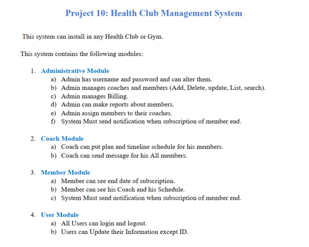

# Health Club Management System 🏋️‍♀️💪



## Description 📝

The **Health Club Management System** is a Java-based application designed to help health clubs manage their operations. It includes features for tracking members, assigning coaches, and managing subscriptions. The system does not use a database but instead uses text files for storing data. 📂

The system includes:

- **Admin functionalities**: Add new members, assign coaches, and manage subscriptions.
- **Member functionalities**: Add, update, and display member details.
- **Coach functionalities**: Track which members are assigned to which coaches.
- **Subscription management**: Track and manage membership status. 📅

## Features ✨

- **Admin Features:**

  - 🆕 Add new members.
  - 🏋️‍♀️ Assign coaches to members.
  - 💳 Manage subscriptions (add, update, delete).

- **Member Features:**

  - ✍️ Add, update, or display member data.
  - 📅 Track subscription end dates.

- **Coach Features:**

  - 🧑‍🏫 Assign multiple members to coaches.
  - 📋 Display coach schedules (could be added in future versions).

- **File-based storage**: Data is stored in text files (e.g., `MemberData.txt`, `CoachData.txt`, `AdminData.txt`). 📄

## Folder Structure 📁

The project follows this folder structure:

```scss
health-club-management-system/
├── src/                            # Source code folder
│   ├── models/                       # Data model classes (defines entities)
│   │   ├── User.java                 # Base class for users (Admin, Coach, Member)
│   │   ├── Member.java               # Member class (manages subscription, coach assignments)
│   │   ├── Coach.java                # Coach class (manages training plans, schedules)
│   │   ├── Admin.java                # Admin class (system management, billing, reports)
│   │   ├── Subscription.java         # Subscription class (handles start/end, renewal)
│   │   └── TrainingPlan.java         # TrainingPlan class (manages workout schedules)
│   ├── services/                   # Business logic and services
│   │   ├── Billing.java              # Manages member payments and subscriptions
│   │   ├── NotificationSystem.java   # Sends system notifications (e.g., expiring subscriptions)
│   │   └── FileHandler.java          # Handles file I/O for persisting data
│   ├── gui/                        # GUI-related components and forms
│   │   ├── LoginForm.java            # Login form GUI
│   │   ├── AdminDashboard.java       # Admin dashboard GUI
│   │   ├── CoachDashboard.java       # Coach dashboard GUI
│   │   ├── MemberDashboard.java      # Member dashboard GUI
│   │   └── MainMenu.java             # Main menu or landing page GUI
│   ├── HealthClubSystem.java       # Integrates and coordinates system functionality
│   └── Main.java                   # Entry point to initialize and run the system
├── resources/                      # Data files for persistence
│   ├── MemberData.txt                # Stores member information
│   ├── CoachData.txt                 # Stores coach information
│   └── AdminData.txt                 # Stores admin credentials and data
├── .gitignore                      # Specifies files/folders to be ignored by Git
└── README.md                       # Project documentation and setup instructions
```

## **Description of the Folder Structure:**

### **1. `src/`** — Source Code Folder 🖥️

- **models/**: Contains the data model classes that define the entities of the system, encapsulating the core properties and behaviors.
  - **User.java**: Serves as the base class for different types of users (Admin, Coach, Member), managing common properties such as name and ID.
  - **Member.java**: Represents a member of the health club, managing subscription details, coach assignments, and membership-related functions.
  - **Coach.java**: Manages coach-specific tasks such as creating and assigning training plans to members, and tracking their schedule.
  - **Admin.java**: Defines the admin role, including functionalities like managing users, generating reports, and overseeing system activities.
  - **Subscription.java**: Manages subscription-related logic, including the start, end, renewal, and status of member subscriptions.
  - **TrainingPlan.java**: Defines training plans for members, specifying workout routines, goals, and schedules.
  
- **services/**: Contains the business logic and services that implement the core functionalities of the system.
  - **Billing.java**: Manages the financial transactions within the system, including handling payments and managing subscription fees.
  - **NotificationSystem.java**: Sends notifications to users, such as reminders for expiring subscriptions, payment alerts, or system updates.
  - **FileHandler.java**: Handles reading and writing data to text files, ensuring that member, coach, and admin information is persisted.

- **gui/**: GUI-Related Components and Forms 🖼️
  - **LoginForm.java**: Provides the login interface for all users (Admin, Coach, Member) to securely access the system. It includes fields for entering credentials and authentication logic.
  - **AdminDashboard.java**: Represents the main interface for administrators, where they can manage members, assign coaches, and handle subscriptions.
  - **CoachDashboard.java**: Serves as the main interface for coaches, allowing them to view and manage their assigned members and training schedules.
  - **MemberDashboard.java**: Provides an interface for members to view their profiles, update details, and check subscription statuses.
  - **MainMenu.java**: Acts as the main entry point for navigating the system. It includes options for accessing specific dashboards based on the user role (Admin, Coach, or Member).

- **HealthClubSystem.java**: The main controller of the system, integrating the various components (users, subscriptions, billing, etc.) and orchestrating the system’s operations.
  
- **Main.java**: The entry point of the application that initializes the system and runs the main program logic.

### **2. `resources/`** — Data Storage Files 💾

- **MemberData.txt**: Stores member data such as personal information, subscription status, and expiry dates. It helps in persistent storage of member records.
- **CoachData.txt**: Stores data related to coaches, such as their qualifications, schedules, and the members they are assigned to train.
- **AdminData.txt**: Stores admin-related credentials and configurations, including login information and system settings.

## Why This Structure?

- **Separation of Concerns**: By organizing the code into logical sections based on user roles and functionalities (Admin, Coach, Member), it simplifies maintenance and development.
- **Data Persistence with File-Based Storage**: Storing data in text files is simple and avoids the complexity of database setup, making it easy to manage for a small-scale system.
- **Clear Navigation**: The folder structure is clear and intuitive, allowing developers to easily find and modify specific components.
- **Scalability**: The modular approach allows for easy scalability, where new functionalities or user roles can be added with minimal disruption to the existing codebase.

This structure ensures a clean, organized, and scalable health club management system that is easy to understand and work with for developers. 🚀


## Technologies 🛠️

- **Programming Language**: Java ☕
- **Storage**: Text files for storing member, coach, and admin data (no database). 📂
- **GUI Framework**: Java Swing using NetBeans Design Tool for creating graphical interfaces. 🖼️
- **Libraries/Tools**:
  - Standard Java libraries for file I/O and system operations.
  - NetBeans IDE for GUI design and development.

## Getting Started 🚀

### Prerequisites 🖥️

- Java Development Kit (JDK) version 8 or higher installed.
- NetBeans IDE (with Swing support) for GUI design.
- A GitHub account (for version control and collaboration).

### Installation 🔧

1. Clone the repository:
   ```bash
   git clone https://github.com/DORMODO/health-club-management-system.git
   ```
